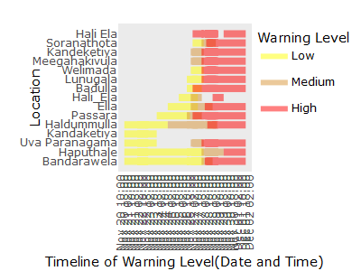

<!-- README.md is generated from README.Rmd. Please edit that file -->

# `ditwahLandslide`

This package provides curated early-warning data on landslides in Sri
Lanka during the Ditwah storm, scraped from the Disaster Management
Centre, Sri Lanka. It includes a structured, machine-readable,
analysis-ready tidy dataset designed to support statistical workflows,
education, and research.

<!-- badges: start -->

<!-- badges: end -->


## Installation

You can install the development version of ditwahLandslide from
[GitHub](https://github.com/) with:

``` r
# install.packages("pak")
pak::pak("thiyangt/ditwahLandslide")
```

## Use cases

``` r
library(ditwahLandslide)
head(ditwah_landslides_warnings)
#> # A tibble: 6 × 13
#>   ID_DataAnalyst Report_Date         Report_Time Message_ID  Valid_From_Date    
#>   <chr>          <dttm>              <chr>       <chr>       <dttm>             
#> 1 NGSM           2025-11-20 00:00:00 16:00       LEWM-20-11… 2025-11-20 00:00:00
#> 2 NGSM           2025-11-20 00:00:00 16:00       LEWM-20-11… 2025-11-20 00:00:00
#> 3 NGSM           2025-11-20 00:00:00 16:00       LEWM-20-11… 2025-11-20 00:00:00
#> 4 NGSM           2025-11-20 00:00:00 16:00       LEWM-20-11… 2025-11-20 00:00:00
#> 5 NGSM           2025-11-20 00:00:00 16:00       LEWM-20-11… 2025-11-20 00:00:00
#> 6 NGSM           2025-11-20 00:00:00 16:00       LEWM-20-11… 2025-11-20 00:00:00
#> # ℹ 8 more variables: Valid_From_Time <chr>, Valid_To_Date <dttm>,
#> #   Valid_To_Time <chr>, District <chr>, Location <chr>, Level <dbl>,
#> #   State <dbl>, Province <chr>
```

``` r
viz_landslide_warnings_from_to(province = "", district = "Monaragala", interactivity=FALSE)
```


